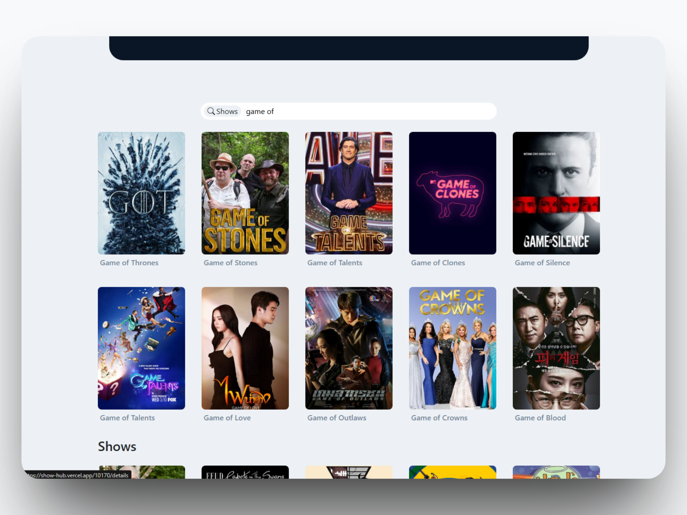
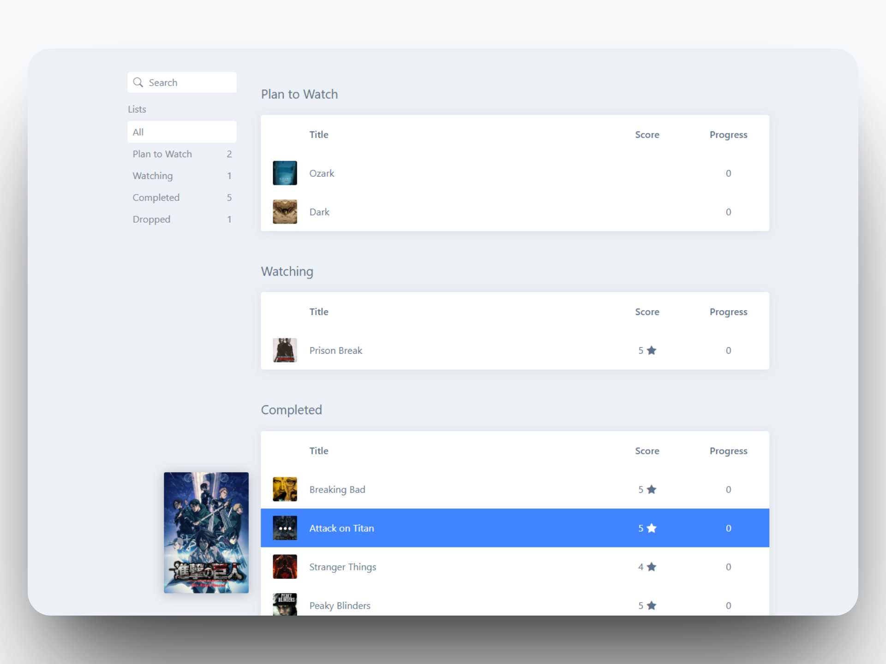

# Hi there👋, I'm Mayank

I'm a **Full Stack Developer** with a focus on the **MERN Stack** (MongoDB, Express, React, Node.js). Currently, I'm expanding my skill set with **Next.js**, **TypeScript**, and **Tailwind CSS**, building modern, production-ready web applications.

While I enjoy writing backend logic, I also have a growing interest in **UI/UX design** — I love the idea of creating experiences that are not just functional but visually appealing and intuitive.

[](https://linkedin.com/in/mayank-singh-tomar) [](https://medium.com/@MayankDotTxT) [](https://reddit.com/user/KA1S3L) [](https://x.com/MayankDotTxT) [](mailto:mayanktomar281@gmail.com) 

```yaml
{
  "currentlyFocusingOn": [
    "Building scalable apps with Next.js",
    "Writing clean, type-safe code with TypeScript",
    "Creating better UIs with Tailwind CSS"
  ],
  "openTo": [
    "Collaboration on exciting projects",
    "Remote or freelance job opportunities"
  ],
  "goals": [
    "Master TypeScript & Next.js for real-world projects",
    "Improve frontend design skills",
    "Continuously contribute to building useful products"
  ],
  "outsideOfCode": "I just be crashing out with my Spotify, playing Elden Ring or reading Albert Camus."
}
```

> _"The best way to learn is by building."_

I'm always working on personal projects to sharpen my skills — feel free to check them out!

# 💻 Tech Stack:


# Featured Project
**[SHOW HUB](https://github.com/MAYANK-T0MAR/show-hub)** TV-Show organizer - discover, track, discuss TV Shows and create lists, share reviews, and join the conversation. Powered by React, Node.js, Express and MongoDB.

<details>
<summary><strong>🔽 CLICK TO VIEW FULL GALLERY</strong></summary>
<br>
  
|  |  |
|:--:|:--:|
| **Search any TV Show** | **Episodes Page** |

|  |  |
|:--:|:--:|
| **Add Show to your List** | **User Lists Page** |

<p align="center">

<br>
<em>Write Reviews with HTML Rich Formatting</em>
</p>

<p align="center">

<br>
<em>Create Threads</em>
</p>
</details>

# Minor Projects
### Instagram Homepage
<p align="center">
  
  <br>
  <em>When I was trying to learn CSS</em>
</p>

### Gemini Clone
<p align="center">
  
  <br>
  <em>When I was trying to learn API Integration</em>
</p>

# 📊 GitHub Stats:


<!--  -->
<!--   -->
<p align=cente>


</p>
<!--   -->
